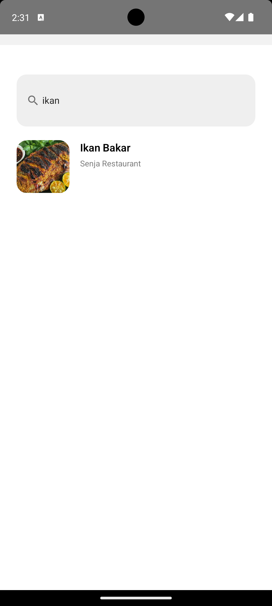
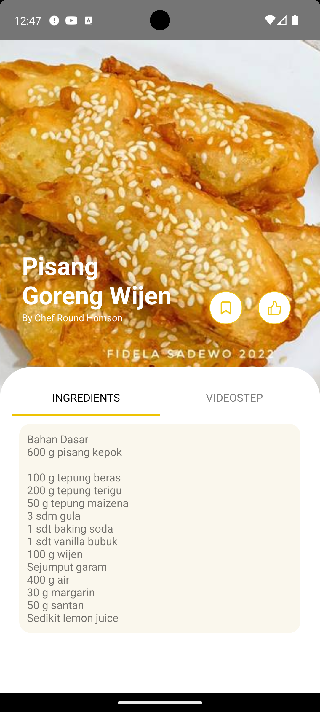
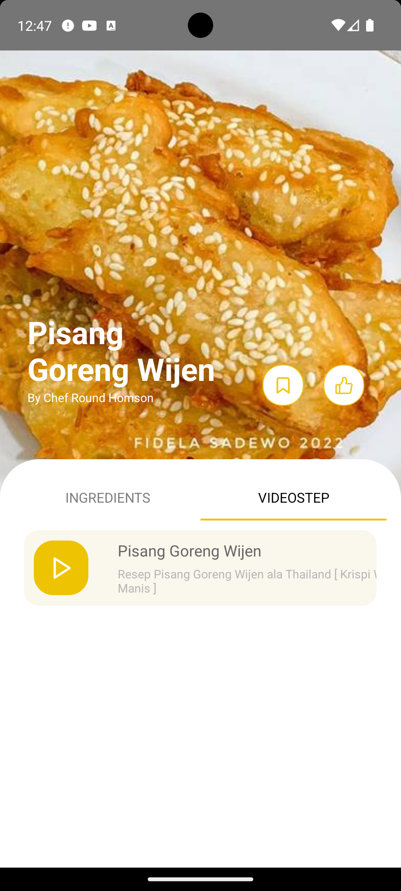
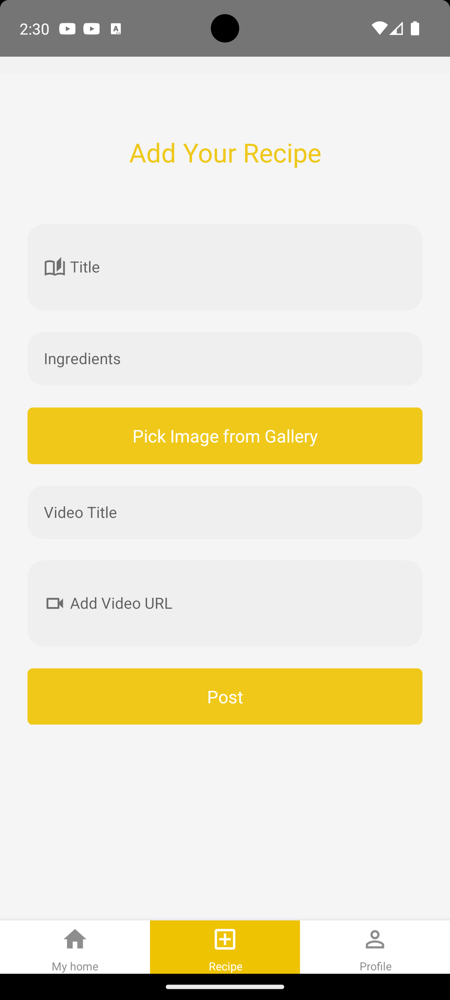
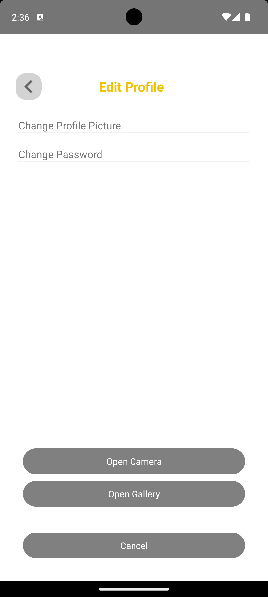
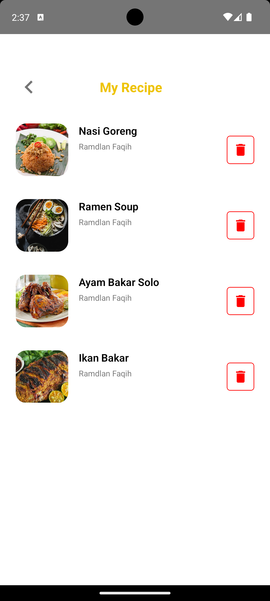
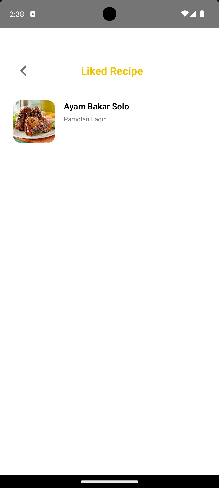
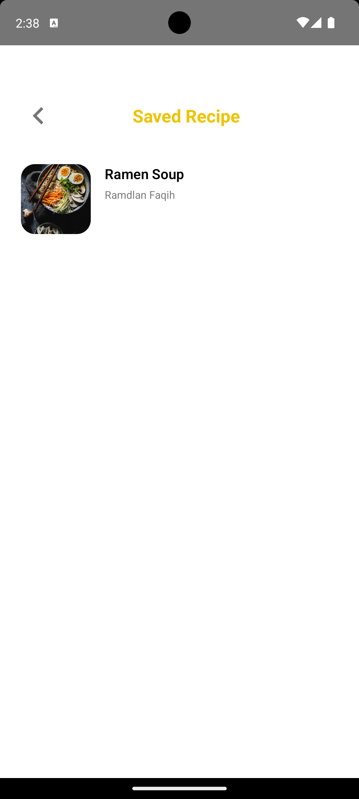

## Mama Recipe Mobile App Documentation

This documentation provides a comprehensive guide to the mobile app development of Mama Recipe. Here, you will find detailed information about the project's structure, components, and usage guidelines. Please read through this document carefully to gain insights into the Mama Recipe mobile app.

## Table Of Content

- [Project Structure](#project-structure)
- [Description](#description)
- [Screenshots](#screenshots)
- [Built With](#built-with)
- [Installation](#installation)
- [Usage](#usage)
- [Related Project](#related-project)
- [Contributing](#contributing)

---

## Project Structure

```plaintext
mama-recipe-mobile/
|-- assets/
|   |-- images/
|   |-- fonts/
|-- src/
|   |-- components/
|   |   |-- Auth/
|   |   |-- Home/
|   |   |-- RecipeDetails/
|   |   |-- Profile/
|   |-- navigation/
|   |-- redux/
|   |   |-- actions/
|   |   |-- reducers/
|   |   |-- store.js
|-- .gitignore
|-- package.json
|-- README.md
```

## Description

Mama Recipe mobile app allows users to access the Mama Recipe platform on their mobile devices. Users can browse recipes, watch cooking tutorials, and create their own recipes. The app provides a seamless experience for users to explore and share their love for cooking.

## Screenshots

<details>
  <summary>
    Splash Screen
  </summary>

</details>

<details>
  <summary>
    Login
  </summary>

</details>

<details>
  <summary>
    Home
  </summary>

</details>

<details>
  <summary>
    Search
  </summary>

</details>

<details>
  <summary>
    Detail Recipe
  </summary>

</details>

<details>
  <summary>
    Detail Video
  </summary>

</details>

<details>
  <summary>
    Add Recipe
  </summary>

</details>

<details>
  <summary>
    Profile
  </summary>

</details>

<details>
  <summary>
    Edit Profile
  </summary>

</details>

<details>
  <summary>
    My Recipe
  </summary>

</details>


<details>
  <summary>
    Liked Recipe
  </summary>

</details>

<details>
  <summary>
    Saved Recipe
  </summary>

</details>

## Built With

- **React Native**: Framework for building native mobile apps using React.
- **React Navigation**: Library for implementing navigation in React Native apps.
- **Axios**: Library used for making HTTP requests to the Mama Recipe backend server.

## Installation

1. Ensure Node.js and npm are installed on your system.
2. Clone this repository to your local machine: `git clone https://github.com/RamdlanFaqih/MamaRecipe-Mobile.git`
3. Navigate to the project directory: `cd mama-recipe-mobile`
4. Install project dependencies: `npm install`

## Usage

1. Make sure the Mama Recipe backend server is running.
2. Run the mobile app on your emulator or physical device: `npm run-android`
3. The app will start on your emulator or device, allowing you to explore and interact with Mama Recipe.

## Related Project

- [Mama Recipe Backend](https://github.com/RamdlanFaqih/BE-Mama-Recipe) - Backend for Mama Recipe
- [Mama Recipe Frontend](https://github.com/RamdlanFaqih/mama-recipe-redux) - Web frontend for Mama Recipe

## Contributing

We welcome contributions from the community. If you encounter bugs or wish to add new features, please create a pull request or issue in this repository. Your help is greatly appreciated!

Feel free to reach out if you have any questions or need further assistance. Thank you for your contribution to the Mama Recipe mobile app development!
